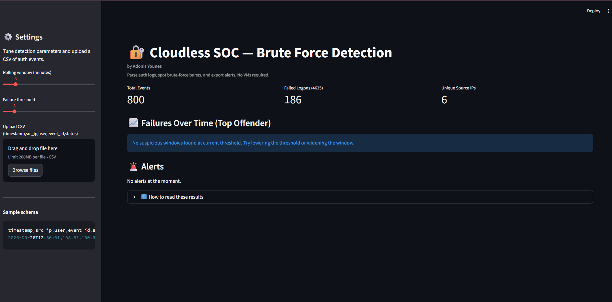

# 🛡️ Cloudless SOC: Brute Force Detection

A Python/Streamlit web app that ingests authentication logs, finds bursty failed-logon activity with a sliding window, and shows results in a clean dashboard.



---

## ✨ Features
- **Web UI**: Upload a CSV of auth events and tune detection from the sidebar.
- **Sliding window detection**: Pick window size (minutes) and failure threshold to flag brute-force bursts.
- **KPI cards**: Total events, failed logons, and unique source IPs at a glance.
- **Professional chart**: Polished area chart for the top `src_ip → user` offender with a visible threshold line.
- **Alerts table**: Sortable table of hits with timestamp, source IP, user, failures, and a rule label.
- **Export**: One-click download of the Alerts as CSV.
- **Cross-platform**: Works on Windows, macOS, and Linux.

---

## 🚀 Quick Start (Local Demo)

Clone the repo and run the Streamlit app:

```bash
git clone https://github.com/AdonisYounes/cloudless-soc-vscode.git
cd cloudless-soc-vscode

python -m venv .venv
# Windows
.\.venv\Scripts\Activate.ps1
# macOS / Linux
source .venv/bin/activate

pip install -r requirements.txt
streamlit run app.py
